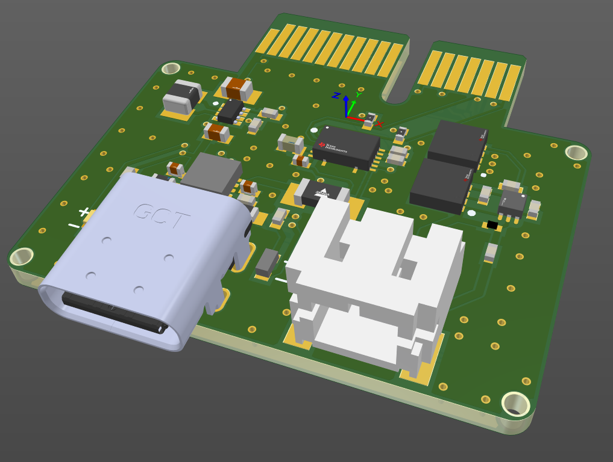
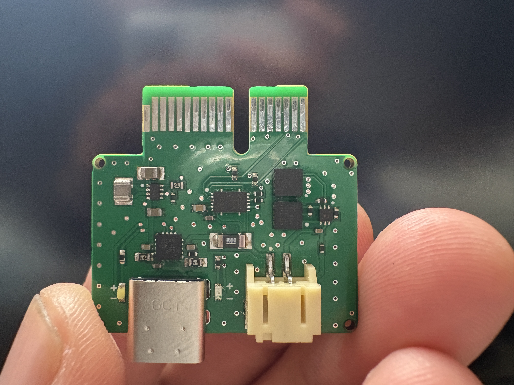

# Dingboard

Avionics for the rocket

Maybe I should rename this before it's too late. Actually it's already too late.
******

<figure markdown="span">
  { width="600" }
  <figcaption>December 1st: Power Board 0.0.2</figcaption>
</figure>

<figure markdown="span">
  { width="600" }
  <figcaption>December 19st: Power Board 0.0.2</figcaption>
</figure>

<figure markdown="span">
  { width="600" }
  <figcaption>December 7th: Avionics bay</figcaption>
</figure>

## Initial Requirements and Design Goals

The primary goal of dingboard is to enable my personal learning.
This will be the first board of many. This wil be a CAN enabled system in a 4-inch diameter form factor.

### Primary Functional Requirements for dingboard:

- Easy to operate and understand
- Don't be janky
- Fully open source
- Assemblable by JLCPCB PCBA
- Utilize all known best practices to enable scalability

### Secondary Functional Requirements for dingboard:

- Battery charger with quick disconnect using magnetic connector.
- Remove before flight banana pins for ejection charges
- Point of load regulation

[Here's the link](https://github.com/zeulewan/dingboard) to the project repo with the Solidworks and Altium files.

## Things for the next board

- USB multiplexer controlled by something like a raspberry pi zero. The backplate will have the MUX. There will also be the ability to digitally reboot things. We can remove all usb ports except for on the rp zero.
- Ethernet
- 2.4 GHz for camera transmission
- Usb protection IC

For now we still have to figure out CAN

## Video references

Good videos:

- [Altium Designer Quick-Start Tutorial with Phil Salmony from Phil's Lab](https://www.youtube.com/watch?v=YTGzncKU5RY)

- [Raspberry Pi RP2040 Hardware Design | Altium Designer | JLCPCB - Phil's Lab #28](https://www.youtube.com/watch?v=X00Cm5LMNQk)

- [How To Keep Components Connected When Moving | Altium Designer](https://www.youtube.com/watch?v=wfML_NWr2sI)

- [Microcontroller-Based Hardware Design With Altium Designer - #3 USB C](https://www.youtube.com/watch?v=t67KcQHhIC4&list=PL3aaAq2OJU5EsYtNwTPHNO3RHNJN34FbO&index=16)

- [ECAD-MCAD CoDesign with Altium 365 & SOLIDWORKS](https://www.youtube.com/watch?v=ciPQ3UqYVuc)

- [Types of PCB Grounding Explained | PCB Layout](https://www.youtube.com/watch?v=19WnYPhNOH0)

- [Impedance Explained.](https://www.youtube.com/watch?v=3QtpaICzSNc)

## Open source

The student rocketry community is quite open to sharing ideas. This makes it easier for new student teams such as my own to build themselves up. The goal is to have a thriving space industry. The bottom line is that the more people we have that are knowledgeable in rocketry the better chance humanity has. This is largely the philosophy the rocketry teams I've spoken to have. This is one reason why MARS strives to open source everything we do. We stand on the shoulders of giants. It is unfeasible to donate to every single open source project you gain knowledge from, so the least we can do is to contribute back the the community by open sourcing everything we do. We have everything to gain from the success of others. Open source doesn't mean copying others stuff, and being a free loader. We strive to learn from and contribute to each step of the process.

### Inspiration

I've been inspired by rocketry teams such as [Waterloo](https://www.waterloorocketry.com/), [Queens](https://qret.ca/), [Etes](https://rockets.etsmtl.ca/), and [Oronos](https://oronospolytechnique.com/en.html). Waterloo is extremely helpful due to all of their documentation being public on their website. I've visited Queens a few times and they are always okay with sharing info. Without these two teams, MARS' success would be a lot harder.

#### CAN bus

Every team settles on CAN bus. I have no experience with it, but I will be implementing it on dingboard.

#### Modularity with PCIe connectors

The modular system I first noticed at LC 2023. Etes showed me their system. I noticed Queens also did it, then I noticed Oronos did it. It seems like an obvious place to start, I mean it makes things really easy and elegant. The downside is that its not as structurally robust as Waterloos RocketCAN system.

<figure markdown="span">

  
  <figcaption>ÉTS Anirniq</figcaption>

  
  <figcaption>QRET</figcaption>

  
  <figcaption>ORONOS</figcaption>

</figure>

## Battery

For the SRAD board we will be using a SRAD battery back and the opposite is true for the COTS stuff. For the first launch it will be a 2s 2p pack inspired by [this video.](https://www.youtube.com/watch?v=3dD5KmM8ciU)
