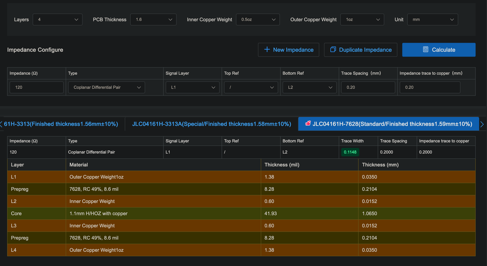

# Backplate

{ width="300" }

## Characteristic Impedance

The characteristic impedance should be 120 ohms. The bus should also have two 120 ohm resistors at either end.

I need to know if I can fit my traces between these pins or if I need to use more pins for each net. Gonna be using a 4 layer PCB with a stack up of 
Signal 
GND 
Power 
Signal

{ width="400" }

### Calculating Impedance 

#### By hand

[Gonna come back to this](https://www.youtube.com/watch?v=0fteCxn5XXA)

[discussion on stack exchange ](https://electronics.stackexchange.com/questions/516824/can-bus-on-pcb-traces-instead-of-twisted-pair-cable-points-to-consider)

<!-- First capacitance:

$$
C = \frac{\varepsilon A}{d}
$$

This is the impedance

$$
Z_0 = \sqrt{\frac{L}{C}}
$$ -->

#### JLCPCB Calculator

[Calculator](https://jlcpcb.com/pcb-impedance-calculator)
If around 0.1148mm is right, then I'll be able to route between the PCIe pins just fine. 

## Links

[pcie socket](https://www.digikey.ca/en/products/detail/amphenol-cs-fci/10018784-10210TLF/1002344)

[banana socket](https://www.digikey.ca/en/products/detail/pomona-electronics/2269-0/736335?s=N4IgjCBcoEwJxVAYygMwIYBsDOBTANCAPZQDaIAzACwBsVcA7CALqEAOALlCAMocBOASwB2AcxABfQmAAcFRCBSQMOAsTKUwDGTpbsukXgJHipIALQ0FSgQFc1JSORgsJZl05AAhAIIA5fx8AAgApHwBhAGk9EABWBTYoMHZEyBhYtyA) order an extra 5/16-32 nut with this

[cad from here](https://www.3dcontentcentral.com/secure/download-model.aspx?catalogid=171&id=587137)

[banana plug](https://www.digikey.ca/en/products/detail/mueller-electric-co/BU-PMDP-S-2/4073757)

step file from [this website](https://www.3dcontentcentral.com/download-model.aspx?catalogid=171&id=626290)

[High-Speed Layout Guidelines for Reducing EMI for LVDS SerDes Designs](https://www.ti.com/lit/an/snla302/snla302.pdf)

[Critical Spacing of CAN Bus Connections](https://www.ti.com/lit/an/slla279a/slla279a.pdf)

### Videos

- [KiCad Controlled Impedance Traces (e.g. 50Ω) - Phil's Lab #3](https://www.youtube.com/watch?v=0fteCxn5XXA)
- [What Are Differential Pairs? ](https://www.youtube.com/watch?v=7DF25ohH8v4)
- [When Does a Trace Act Like a Transmission Line?](https://www.youtube.com/watch?v=UhTxEaw-Mck)

