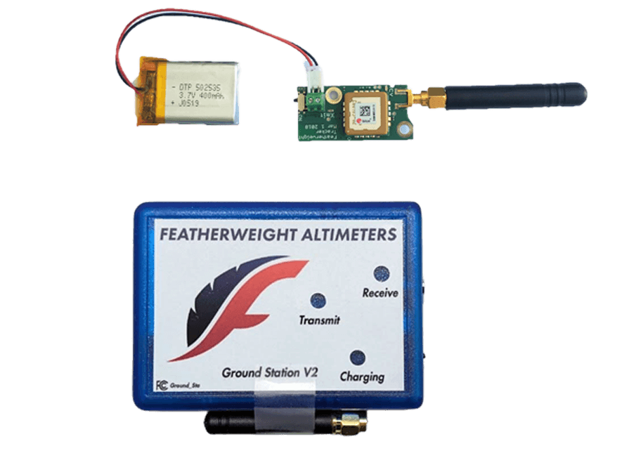

# COTS Avionics

## Requirements

From the [Launch Canada 2025 Rules & Requirements Guide](Launch+Canada+Rules+and+Requirements+Guide+2025R3.pdf), the requirements for COTS components are:

### Rocket Tracking & Transmissions

*"All parts of the rocket that are intended to be recovered separately (e.g., separate multistage parts, deployed payloads, etc.) need to have a COTS tracking device incorporated into them. This should allow teams to track and recover all components. The COTS system may be the primary or back up system, but its presence is required."*

### Official Altitude Logging

*Teams are required to prove that their altitude matches that which the rocket was designed for and simulated to achieve. For this purpose, all rockets must carry a COTS barometric altimeter with on-board data storage, which will provide an official log of apogee for scoring. This may be a standalone COTS product, or a feature of a COTS flight computer, for example one used for recovery system deployment. If the project features a deployable payload, the official altitude logging device shall be mounted to the launch vehicle and not the payload.*

*At the launch site, there will be a designated area used for judges. Each team must report directly to their assigned judges at the competition once they return after recovering their rocket, bring any necessary equipment to show judges their recovery data (e.g., laptop and cable), and be prepared to also email this same information to Launch Canada at competition@launchcanada.org. Some altimeters are designed to report apogee through a series of beeps, but beeps shall NOT be accepted except as a last resort. Failure of a team to provide their recovery data to Launch Canada will result in them receiving no score for this aspect of the Launch Challenge.*

## GPS and Altimeter Selection

One of the the only COTS GPS and altitude transmitters it the [Featherweight GPS Tracker](https://www.allrockets.ca/Altimeters/Full-System-Tracker) which costs $581.90.

