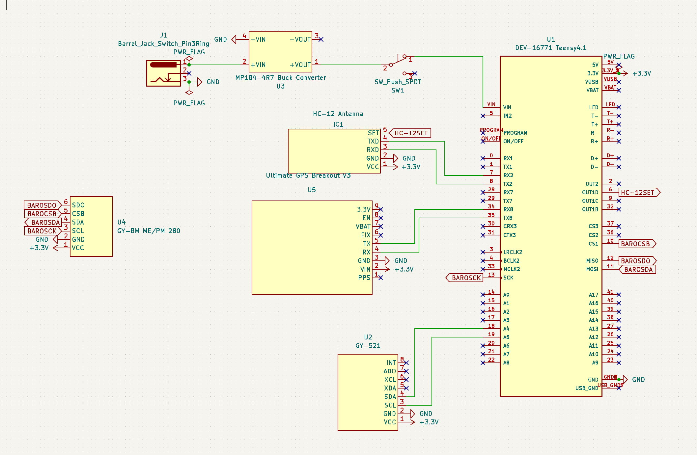
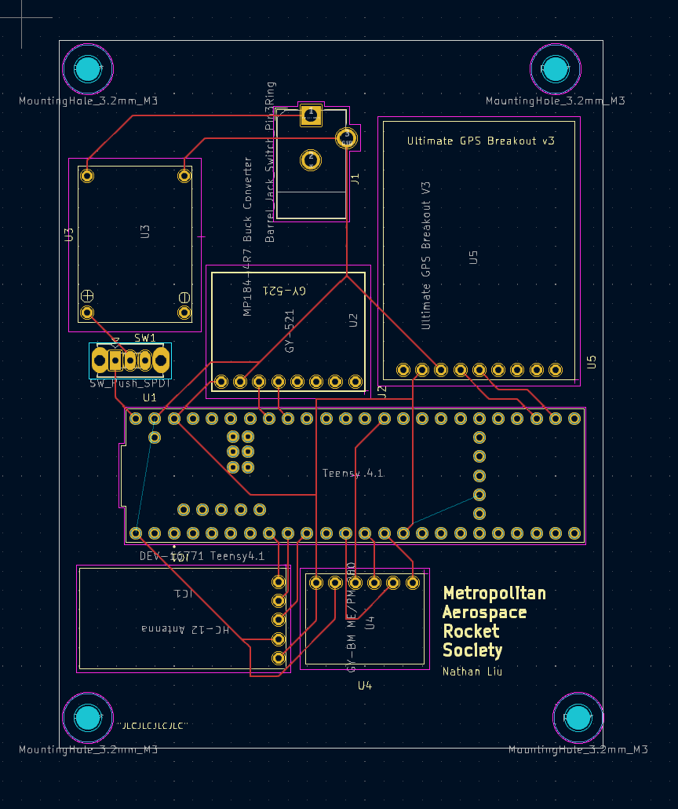

# PCB Guide

## Introduction

A Printed Circuit Board (PCB) is a crucial component in electronic devices. It provides a platform for connecting and supporting various electronic components, enabling the device to function properly. This guide will provide an overview of PCBs, their importance, and the key considerations when designing and manufacturing them.

## Table of Contents

- [What is a PCB?](#what-is-a-pcb)
- [PCB Design Considerations](#pcb-design-considerations)
- [PCB Manufacturing Process](#pcb-manufacturing-process)
- [Common PCB Issues and Troubleshooting](#common-pcb-issues-and-troubleshooting)
- [Conclusion](#conclusion)

## What is a PCB?

A PCB is a flat board made of non-conductive material, typically fiberglass, with conductive pathways etched or printed onto it. These pathways, known as traces, provide the electrical connections between different components on the board. PCBs can be single-sided, double-sided, or multi-layered, depending on the complexity of the circuit.

## PCB Design Considerations

Designing a PCB involves several considerations to ensure optimal performance and reliability. Some key factors to consider include:

- Component placement and orientation
- Trace routing and signal integrity
- Power and ground plane design
- Thermal management
- Design for manufacturability (DFM) guidelines

## PCB Manufacturing Process

The PCB manufacturing process involves several steps, including:

1. Designing the PCB layout using specialized software.
2. Generating the Gerber files, which contain the necessary information for manufacturing.
3. Fabricating the PCB by etching or printing the conductive traces onto the board.
4. Drilling holes for component mounting.
5. Applying solder mask and silkscreen for protection and labeling.
6. Testing the PCB for functionality and quality assurance.

## Common PCB Issues and Troubleshooting

PCBs can encounter various issues during manufacturing or operation. Some common issues include:

- Short circuits
- Open circuits
- Signal interference
- Component placement errors
- Soldering defects

This section will provide troubleshooting tips and solutions for these common PCB issues.

## Conclusion

PCBs are essential components in modern electronic devices, enabling the interconnection and functionality of various electronic components. Understanding the basics of PCB design and manufacturing is crucial for creating reliable and efficient electronic systems.

For more detailed information and guidelines, refer to the specific sections in this guide.

