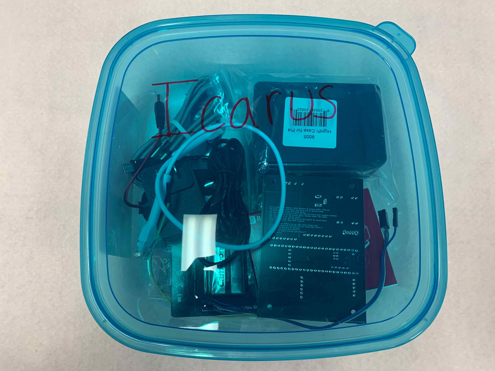
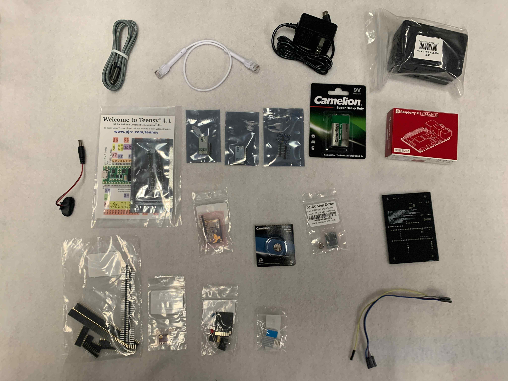

# Avionics Kits 2023-2024
This is an avionics kit:

This is what's inside the kit:

Stuff in the kit:

- Cables and cables
    - [Micro USB](photos/parts/uUSB.jpg)
    - [Ethernet](photos/parts/ethernet.jpg)
    - [9v to barrel male barrel jack](photos/parts/dupont.jpg)
    - [5 Dupont female-female wires](photos/parts/dupont.jpg)
    - [Raspberry Pi power supply](photos/parts/pwrsupply.jpg)
- Breakout Boards
    - [Teensy 4.1](photos/parts/teensy.jpg)
    - [Two HC-12 Antennas](photos/parts/hc12.jpg)
    - [MPU 6050 (Accelerometer and gyroscope)](photos/parts/mpu6050.jpg)
    - [Ultimate GPS](photos/parts/gps.jpg)
    - [BMP 280](photos/parts/bmp280.jpg)
    - [Buck Converter (converts 9 volts from battery to 3.3 volts) and switch](photos/parts/bucknswitch.jpg)
- Other stuff
    - [Raspberry pi, Case, and heat sinks for Raspberry pi](photos/parts/rpi.jpg)
    - [9v battery](photos/parts/ninev.jpg)
    - [GPS battery](photos/parts/gpsbattery.jpg)
    - [uSD card, uSD card adapter with uSD card in it, resistor, LED, barrel jack](photos/parts/randybag.jpg)
    - [PCB](photos/parts/pcb.jpg)
    - [Bag of stand off pins and headers](photos/parts/pins.jpg)

