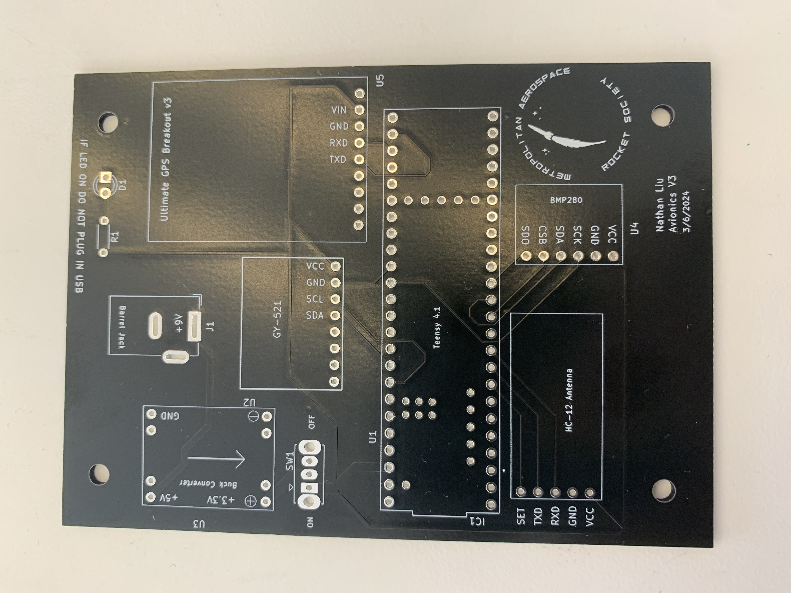

# Flight Computer
In this section we will talk about how to solder and program the default flight computer. 

## Soldering

### Intro
This is the PCB.

This is the finished PCB.

PLACEHOLDER

## Programming