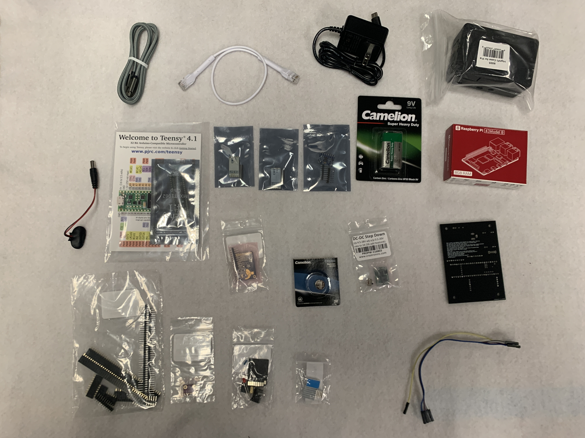

# Avionics Kits
This is an avionics kit:

This is what's inside the kit:

Stuff in the kit:
- Cables and cables
    - Micro USB 
    - Ethernet 
    - 9v to barrel male barrel jack
    - 5 Dupont wires
    - Raspberry Pi power supply
- Breakout Boards
    - Teensy 4.1
    - Two HC-12 Antennas
    - MPU 6050 (Accelerometer and gyroscope)
    - Ultimate GPS
    - BMP 280
    - Buck Converter (converts 9 volts from battery to 3.3 volts) and switch
- Other stuff
    - Raspberry pi and case
    - Heat sinks
    - 9v battery
    - GPS battery
    - uSD card, uSD card adapter with uSD card in it, resistor, LED, barrel jack
    - PCB
    - [Bag of stand off pins and headers](photos/parts/pins.JPG)

## Soldering

### Intro
This is the PCB.

This is the finished PCB.

PLACEHOLDER

## Programming