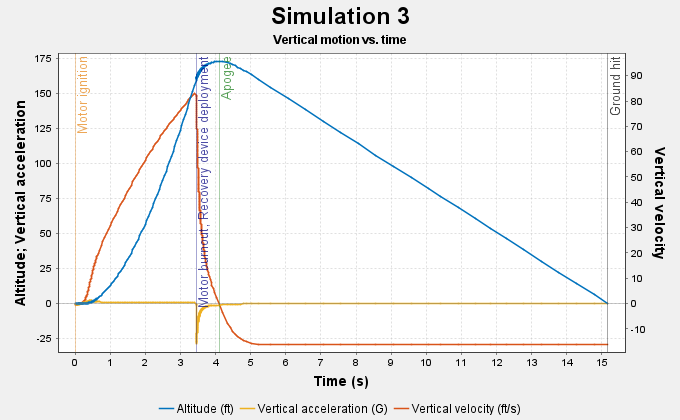

# Rocket Guide

This is where we will provide detailed info on the rocket, including its materials, how it's built and its flight. Check out the [onshape] for a view of it. [Download the step file of the avionics PCB](Avionics-System.step)

[onshape]: https://cad.onshape.com/documents/2ab14303b31030a4e68ba222/w/26f958360873c4551b49868e/e/71cf9a7cd6c11280b6eabd86

The way this team works, is that we have a default template for everything including the rocket and the avionics. The teams are free to switch things and request special parts, but since most are beginners they just go with the default.

## Components

We are using F motors. We decided to go with phenolic tubes. 

<iframe width="400" height="400" src="https://docs.google.com/spreadsheets/d/e/2PACX-1vTexvXlS_TQCoj--VuakJlw2FgXEVW8qgwKOV_IwisWCGN2COxgbx17rZAPSIIpS6KMJLeDdysvlwRf/pubhtml?widget=true&amp;headers=false"></iframe>

## OpenRocket

By modeling their rocket in OpenRocket, teams can get an idea of the center of pressure and the center of gravity of their rocket, as well as the resulting stability. Additionally, running simulations with the model will yield graphs such as the one below, showing elements such as the velocity over time and the expected apogee point.

Below is an example of an acceptable OpenRocket model. The stability should be between 1 and 1.5 cal. The avionics is represented by a mass component of 85 grams.

