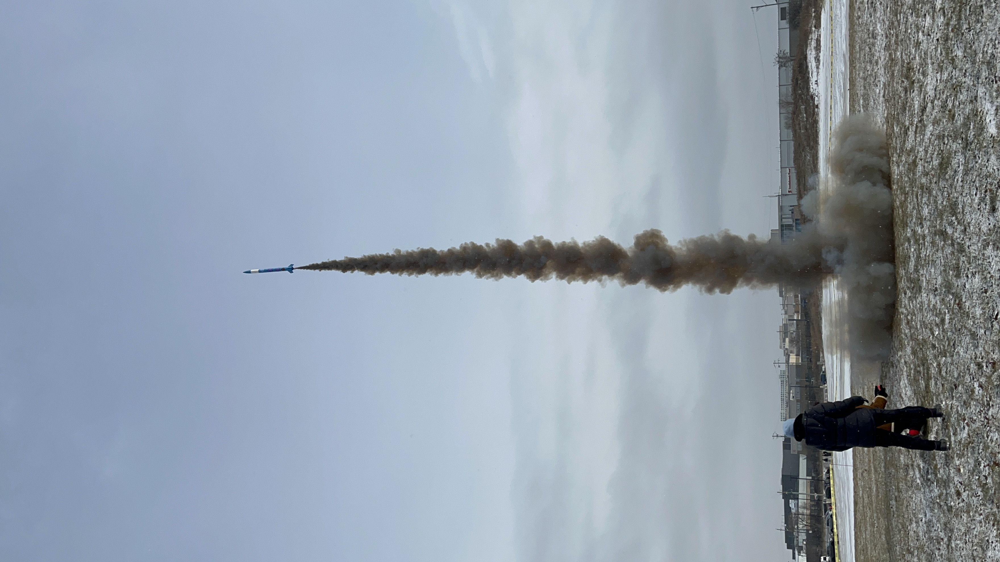
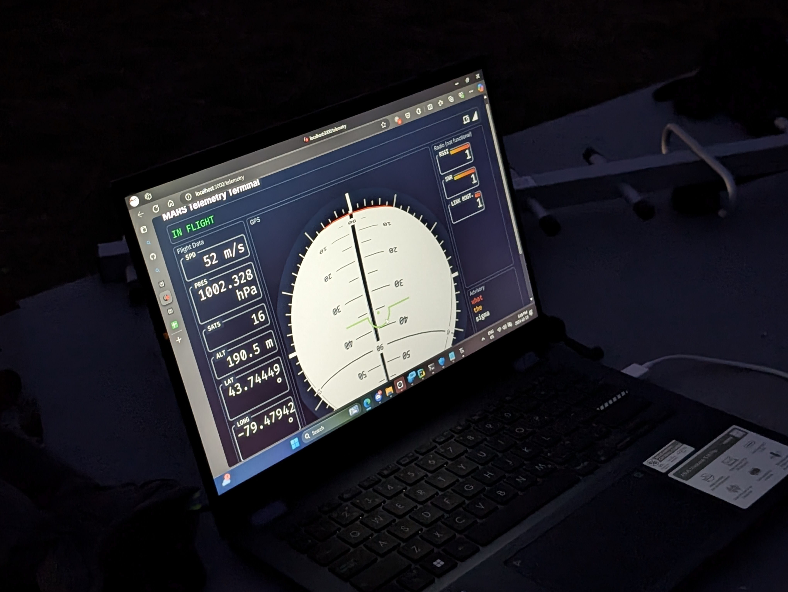
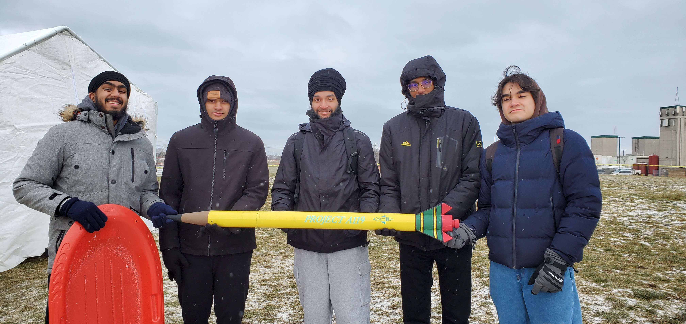
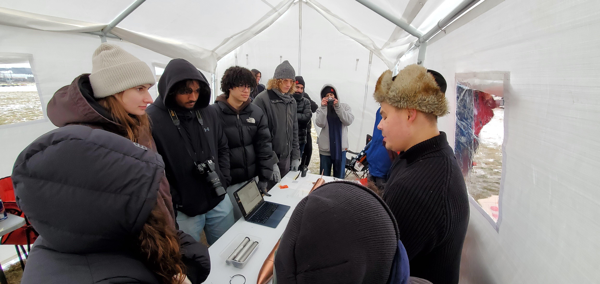
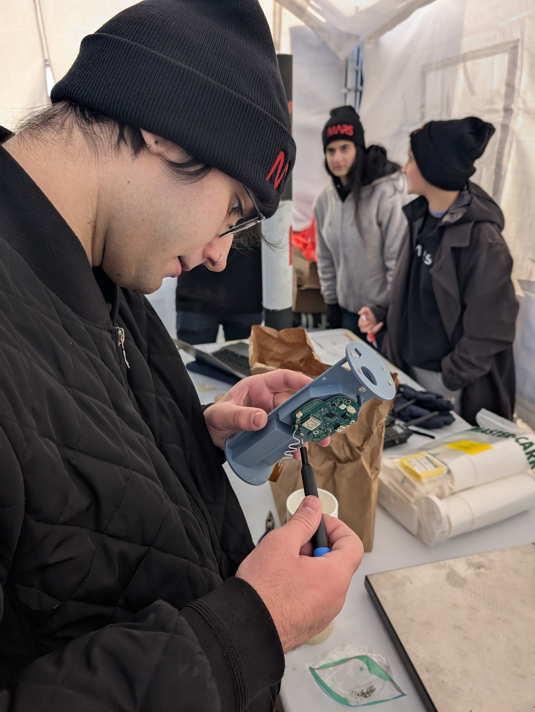

The MARS Competition took place on the 19th and 20th of December and was a great success!
We managed to launch a grand total of 22 rockets, and we will recover them all (eventually(shoutout to HERMES)).

Even though it was very cold, all of the teams performed well and we're proud of everyone's success.

We found a lot of things to work on and improve for next semester, and the next competition in May 2025 will be even better, stay tuned!

Our winners will be announced during our Winter 2025 Kickoff meeting, so make sure to show up (details will be announced closer to the date).

Also, massive shoutout to our amazing avionics guys Anthony and Nathan who worked so hard throughout the 2 days, crazy work from you guys thank you!

Big big congrats to all teams who launched, we were so glad to see you all come out, it was a great time.

GO MARS!!!

 
 
 
 

