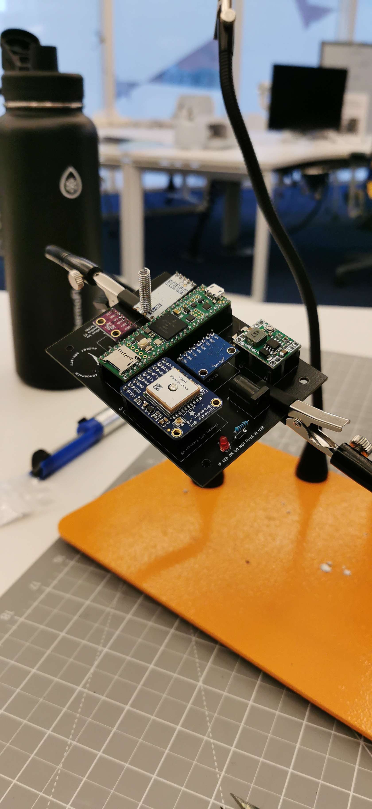
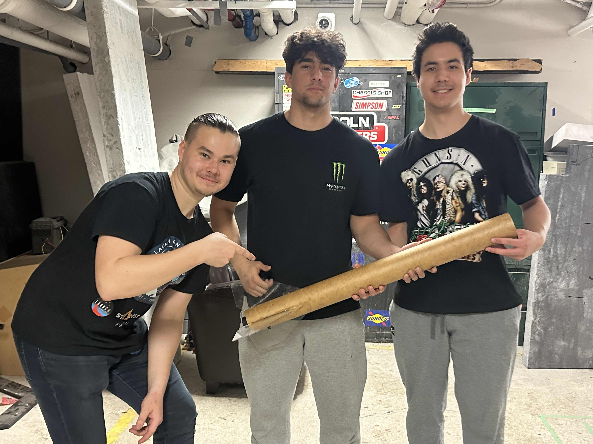
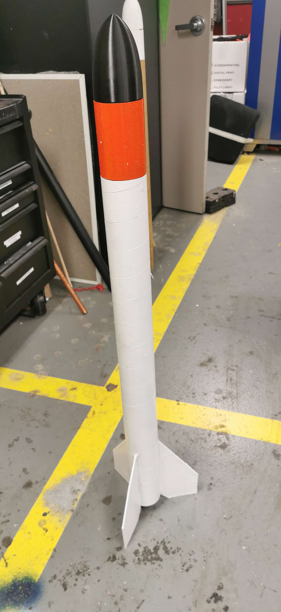

# S.R.A.G

S.R.A.G teams first meeting in November after kick off meeting to discuss possible designs.
 
 
 
 
 

The team created possible designs utilising the CAD software *Onshape*.
 

 
 
 
 

The team completed soldering the avionics which included a gps, radio, barometer and altimeter.
 

 
 
 
 

The team set up a radio connection between the ground station and avionics on board the rocket.
 

 
 
 
 

Collecting parts to manufacture the rocket.
 

 
 
 
 

Team during manufacturing process.
 

 
 
 
 

The team began with the cosmetics by prepping and applying the first coat of paint to the rocket.
 

