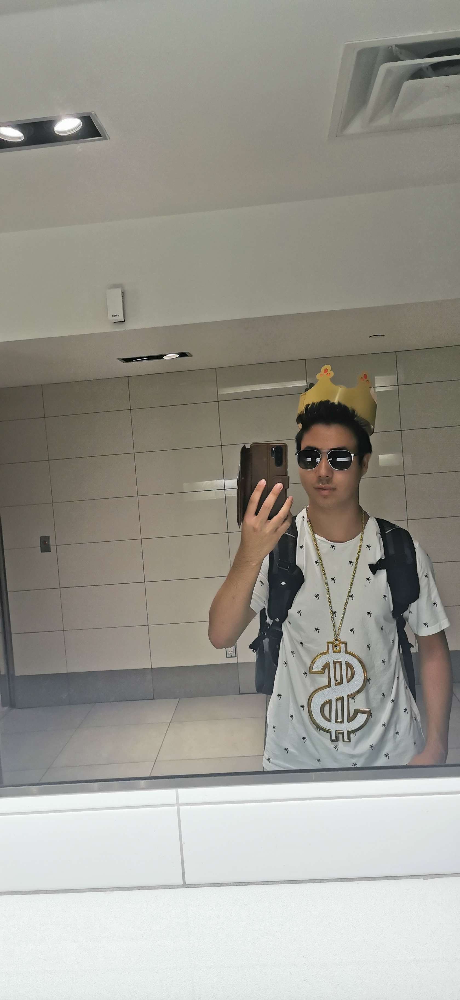

# S.R.A.G

## Meet the team
### Kedron

"Aerospace engineering student who enjoys making stupid youtube videos, building random things and launching rockets"

Here you can find Kedrons [Youtube Channel](https://www.youtube.com/channel/UCLv_qCGiw9wcaPLcR9sBKPw) 

### Miguel
### Jan
### Ryan

### S.R.A.G teams first meeting in November after kick off meeting to discuss possible designs.
 

The team created possible designs utilising the CAD software *Onshape*.

## Avionics
### The team completed soldering the avionics which included a gps, radio, barometer and altimeter.

### The team set up a radio connection between the ground station and avionics on board the rocket.

## Manufacturing
### Collecting parts to manufacture the rocket.

### Team during manufacturing process.

### The team began with the cosmetics by prepping and applying the first coat of paint to the rocket.

### The team worked on the cosmetics of the rocket including applying the team name in decals aswell as drawing flags.

### The team finished cosmetics and the rocket is ready for competition.

## Launch Day

Launch was successful with the rocket recovered in a successful state.

Preview of launch is shown here. The full video with more angles can be found [here](https://www.youtube.com/watch?v=jFPGU56kXCg) on Kedrons Youtube channel.

<video controls src="Untitled video - Made with Clipchamp (3).mp4" title="Title"></video>

