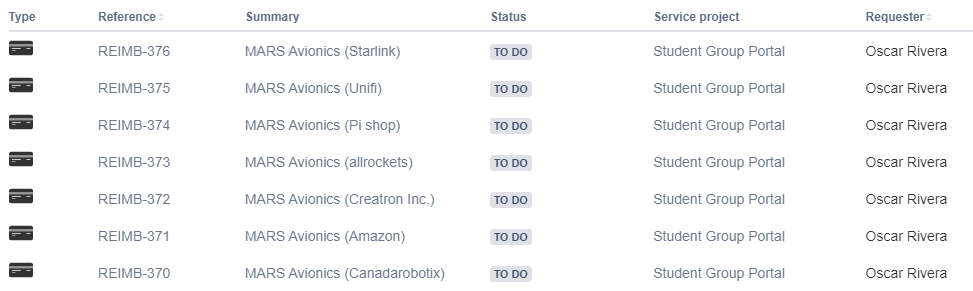

More commits were made to the website today. I accepted a pull request from [ICARUS], who added their image to the teams section. The [tasks] section was updated to include all the little things we have to work on. Documentation for the avionics was worked on, Nikolai wrote down all of the connection for the break out boards on the default [flight computer]. Oscar submitted all the P card requests (see image below), and we are planning to have a meeting with Alessia this friday or monday.

[tasks]: ../../../../Current-Projects/Tasks/index.md
[ICARUS]: ../../../../Teams/ICARUS/index.md
[flight computer]: ../../../../Guidelines/Avionics-Guide/flight-computer/index.md

