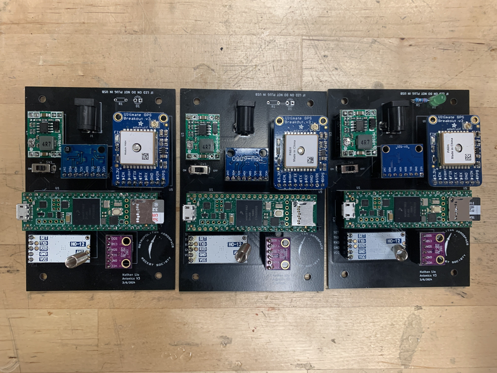
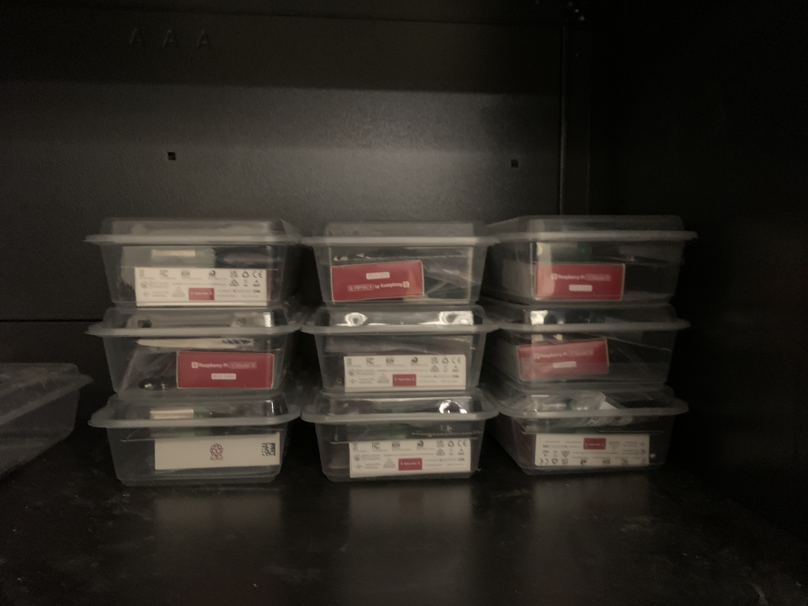

We will be giving out the avionics kits this Saturday, March 16th, at the TMU Rocketry Conference! Please [sign up] if you haven't already. The first step in assembling your avionics kit is soldering. Each team will need to find time to go to the DME to solder their components. The soldering must be completed within three weeks, as that is when the programming session will take place. We'll post a link to the soldering documentation here on Friday.

[sign up]: https://www.eventbrite.com/e/toronto-metropolitan-university-rocketry-conference-2024-tickets-850191173687?aff=oddtdtcreator
