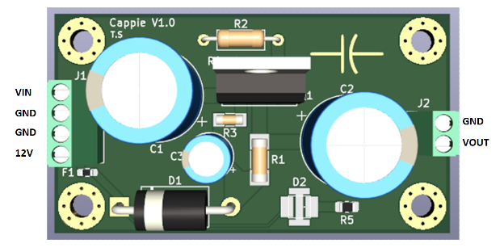

# Cappie V1

**By: Tristan Stanford.** [KiCad Files](tristan/Amp1Project%20-%20Tristan%20Stanford.zip)

Cappie V1 is a capacitor-coupled, single-ended, no negative feedback, class A audio amplifier using the MJE15028G transistor.

The purpose of this amplifier is to test the sonic characteristics of a capacitor-coupled output for driving headphones. Each board is for one channel only, so two boards are required for stereo audio.

Furthermore, due to the design having a low input impedance of ~44 ohms, using a low output impedance source (such as the Apple dongle with 1 ohm output impedance) is required. The design also has a relatively high output impedance of 8.2 ohms, which means that for optimal performance, using higher impedance headphones is recommended (>= 60 ohms).

Volume must be controlled through the signal source (e.g., digitally using the Apple dongle).

Male and female audio connectors (e.g., 3.5mm jack) can be used to connect two boards together for stereo audio.

## Pinout

Where VIN is for the input signal and VOUT is for the amplified output signal.

Note: The ground of the 12V power supply and the ground of the input signal must both be connected to the GND inputs on J1 for the amplifier to work.

## Specifications (simulated/calculated)

- Input impedance: ~44 ohms
- Output impedance: 8.2 ohms
- Max output voltage: 1.27VRMS
- Max signal input voltage: ~0.7VRMS
- Voltage gain (varies with load): >1.62
- Power draw (for one board): ~4.3W
- Required power supply voltage: 12-12.5V
- Frequency response: at least 20-20,000Hz

## Schematic and Design

The input voltage to the board is 12V, which is then dropped down to ~6.4V using a 5.6V zener diode. The reason for this is to have the amplifier be compatible with any common 12V power supply, while also having the supply voltage for the transistor low enough so that the bias current is kept to a manageable amount.

The design is a standard class A setup with the voltage divider created by R3 and R4 setting the operating point of the transistor to ~4.1V with no signal applied. This sets the bias current to around 300mA. R1 sets the output impedance of the amplifier, and the ratio between R1 and R2 approximately sets the voltage gain.

The general process for choosing these values was:

- VCC: chosen based on the desired max output voltage
- R1: chosen based on the desired output impedance, while also keeping the bias low enough so that large heatsinks are not required
- Voltage drop across emitter resistor R2: Anywhere in the range of 1-2V, with higher voltage resulting in a more stable bias network

The rest of the values are then calculated from these chosen values, the gain of the transistor, and the desired voltage divider current ratio (current flowing through R3 of the voltage divider vs the current flowing into the base, usually in the range of 10-16, where higher values result in a more stable voltage divider output).

The value of 4700uF for the input and output capacitors was chosen to set the -3dB cutoff frequency to be less than 2Hz. C3 is there to add some noise filtering for VCC. The value was chosen based on how much physical space was available.

All resistors are either thin film or metal film to reduce noise and increase linearity.
