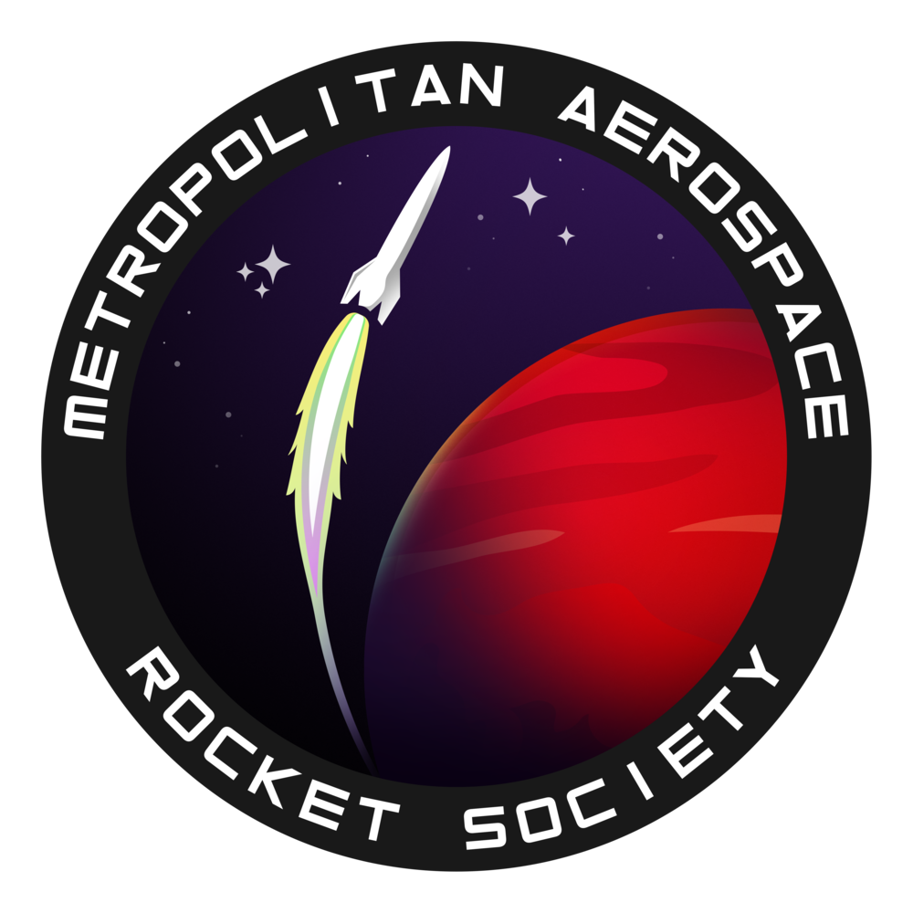

---
hide:
  - navigation
  - toc
---

# Home

**MARS** is [TMU's] Model Rocket Society.

---

 This year (2023), 10 teams will be participating in a competition to see who can launch the best rocket. Check out our [google drive] and [github]. This website is run on [this repo], join our [discord]. This website is designed to last many generations, and to be as easy to contribute to as possible. test

[TMU's]: https://www.torontomu.ca/engineering-architectural-science/programs/undergraduate/programs/

[google drive]: https://drive.google.com/drive/folders/1su8x4vkgnDxWnVwPmmk2WvCllnf5fLLx?usp=sharing

[github]: https://github.com/zeulewan/avionics_code

[this repo]: https://github.com/zeulewan/marswebsite

[discord]: https://discord.gg/BaQZkd2TKj

