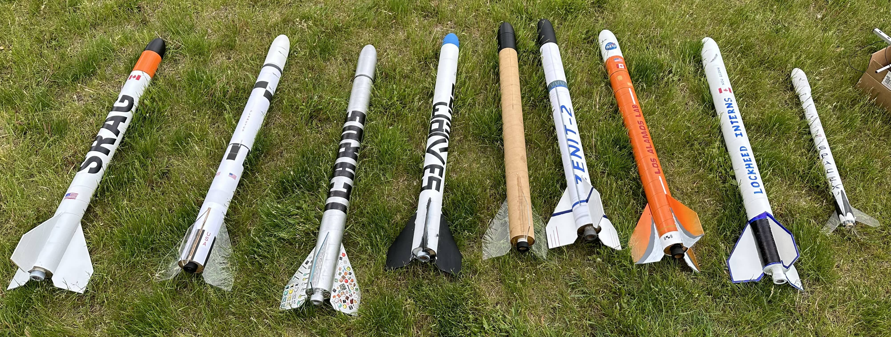

---
hide:
  - navigation
  - toc
---

# Home

The Metropolitan Aerospace Rocket Society or **MARS**, is [TMU's] Rocket Society
---

    <iframe width="560" height="315" src="https://www.youtube-nocookie.com/embed/LEXekLoZZro?si=LyrtVf8yEVynB0X8" 
    title="YouTube video player" frameborder="0" allow="accelerometer; autoplay; clipboard-write; encrypted-media; 
    gyroscope; picture-in-picture; web-share" referrerpolicy="strict-origin-when-cross-origin" allowfullscreen>
    </iframe>

Check out our [github]. This website is run on [this repo], join our [discord].

  

<figure markdown="span">
  { width="800" }
   
  { width="800" }
   
  { width="800" }
</figure>

[TMU's]: https://www.torontomu.ca/engineering-architectural-science/programs/undergraduate/programs/

[github]: https://github.com/marstmu

[this repo]: https://github.com/marstmu/marswebsite

[discord]: https://discord.gg/BaQZkd2TKj

